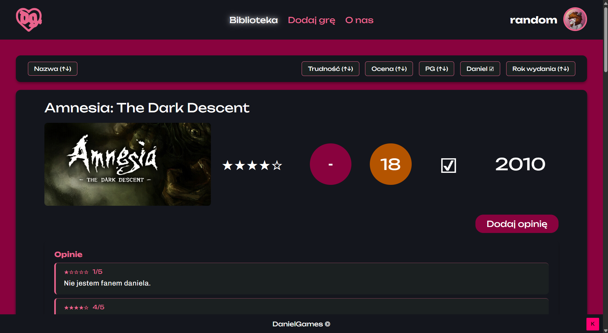
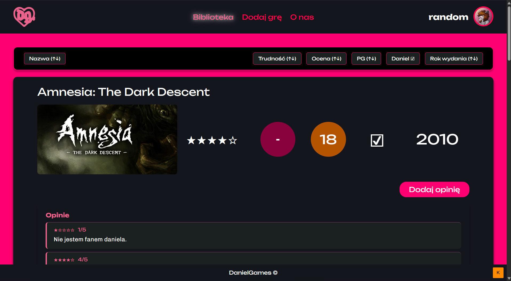
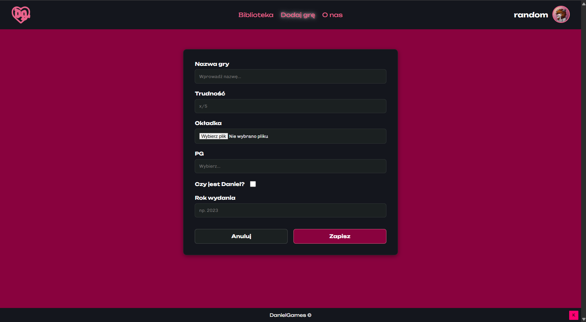
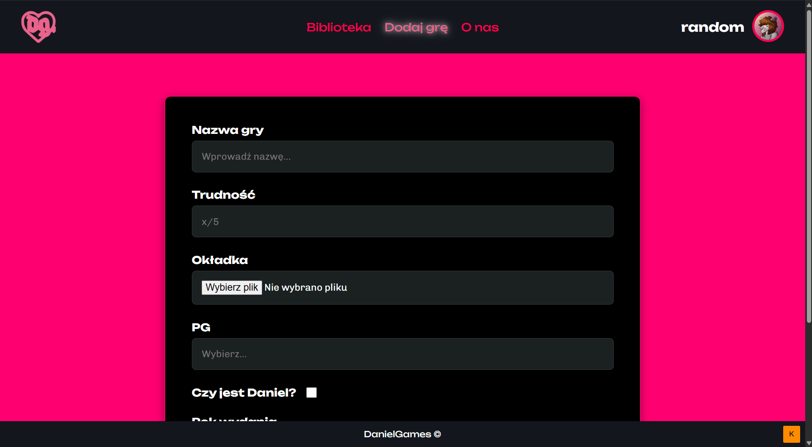
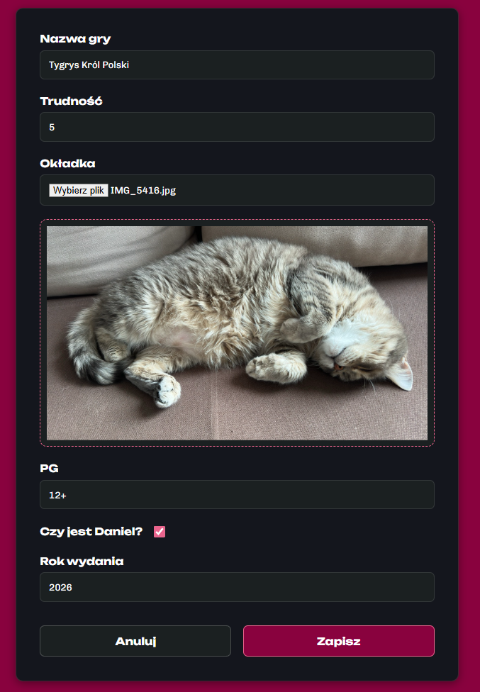
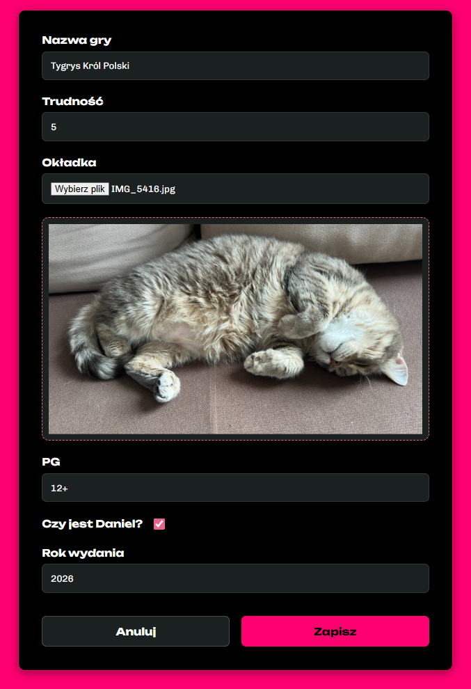
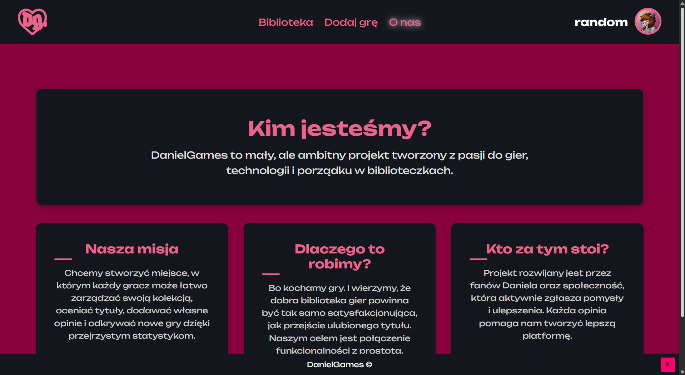

# DanielGames - Biblioteka Gier
#### [Link do projektu w Figmie](https://www.figma.com/design/s25HFnlO3ttlsvkOEacDt7/DanielGames?node-id=0-1&t=higOMiso8P6Gybuj-1)

Kompleksowa aplikacja internetowa dedykowana zarządzaniu osobistą kolekcją gier wideo, ocenianiu tytułów oraz przeglądaniu opinii społeczności. Projekt łączy nowoczesny, responsywny interfejs z dynamicznym systemem ładowania treści Single Page Application (SPA) oraz lokalną bazą danych.

---

## Funkcje aplikacji

* **Interaktywna biblioteka gier**: Przeglądanie pełnej listy gier w postaci czytelnych kart z okładkami, statystykami i ocenami.
  
* **Dynamiczne stronicowanie (Lazy Loading)**: Gry ładowane są paczkami (maksymalnie po 5 sztuk) za pomocą przycisku „Załaduj więcej gier”, co optymalizuje wydajność strony.
  
* **Architektura SPA (Single Page Application)**: Płynne przechodzenie między podstronami bez pełnego przeładowywania dokumentu w przeglądarce (za pomocą autorskiego mechanizmu routingu bazującego na Fetch API).
  
* **System opinii i recenzji**: Wyświetlanie dynamicznie pobieranych ocen oraz tekstowych opinii przypisanych bezpośrednio do konkretnych ID gier z zabezpieczeniem przed atakami XSS (użycie mechanizmu `escapeHtml`).
  
* **Dodawanie nowych gier**: Formularz umożliwiający rozszerzenie bazy danych o nazwę, poziom trudności, ograniczenia wiekowe (PG), rok wydania, flagę obecności „Daniela” oraz podgląd okładki w czasie rzeczywistym przed przesłaniem pliku (`FileReader`).
  
* **Tryb Dostępności (wielokontrastowy)**: Specjalny tryb wysokiego kontrastu aktywowany przyciskiem „K” w stopce. Stan trybu zapamiętywany jest w pamięci przeglądarki (`localStorage`). Zawiera zabezpieczenie typu debounce (cooldown na kliknięcie) z komunikatami wizualnymi typu `Toast`.
  
* **Responsywne Menu Mobilne**: Pełne wsparcie dla urządzeń mobilnych dzięki rozwijanemu menu hamburgerowemu aktywowanemu przy pomocy kodu JavaScript.

---

## Użyte technologie i języki

* **HTML5**: Struktura semantyczna witryny (`<header>`, `<nav>`, `<main>`, `<section>`, `<article>`, `<footer`>).
  
* **CSS3**: Kompleksowe stylowanie wizualne oparte na systemach **CSS Grid** i **Flexbox**, niestandardowe czcionki Google Fonts (*Unbounded*, *Creepster*, *Chivo*), animowane przejścia (`transition`), zmienne motywy klas oraz pełna responsywność (`@media query`).
  
* **JavaScript (Vanilla JS)**: Logika biznesowa po stronie klienta, asynchroniczne zapytania do bazy danych, dynamiczna manipulacja drzewem DOM, parsowanie kodu za pomocą `DOMParser`, obsługa zdarzeń i przechowywanie stanów.

---

## Budowa projektu i struktura katalogów

Aplikacja posiada przejrzysty, modularny podział zasobów na pliki strukturalne oraz zasoby wewnętrzne w folderze `src`.

```text
DanielGames/
├── ladowanie.html          # Szablon SPA (kontener #container)
├── index.html              # Widok biblioteki gier (ładowany dynamicznie)
├── dodajGre.html           # Widok formularza dodawania nowej gry (ładowany dynamicznie)
├── oNas.html               # Widok strony informacyjnej o projekcie (ładowany dynamicznie)
├── README.md               # Dokumentacja projektu
└── src/
    ├── db.json             # Lokalna baza danych w formacie JSON (gry oraz opinie)
    ├── css/
    │   └── style.css       # Główny arkusz stylów aplikacji dla wszystkich podstron i trybów
    ├── img/
    │   ├── logo.png        # Podstawowe logo aplikacji
    │   ├── logo1.png       # Alternatywne logo wyświetlane po najechaniu myszką
    │   ├── avatar.jpg      # Zdjęcie profilowe zalogowanego użytkownika
    │   └── plchld.png      # Obrazek zastępczy (placeholder) dla gier bez okładki
    └── java/
        ├── seeGames.js         # Pobieranie z API i renderowanie kart gier, gwiazdek oraz opinii
        ├── ladowanieStronek.js # Silnik SPA – asynchroniczne ładowanie podstron i obsługa routera links
        └── przyciskDostepu.js  # Zarządzanie trybem dostępności, localStorage oraz powiadomieniami toast
```

---

## Użyte API i integracje

Projekt komunikuje się asynchronicznie za pomocą wbudowanego mechanizmu `Fetch API` z lokalnym serwerem RESTful API emulującym środowisko backendowe. Struktura bazy danych opiera się na dwóch relacyjnych zasobach:

* **Zasób gier (`games`)**: `GET http://localhost:3000/games` – Pobiera pełną listę obiektów reprezentujących gry. Każdy obiekt zawiera klucze takie jak: `id`, `title` (nazwa), `difficulty` (poziom trudności), `rating` (ocena), `age_rating` (klasyfikacja wiekowa PG), `year_of_release` (rok wydania), `daniel` (flaga obecności w kolekcji) oraz `picture` (ścieżka do okładki).
  
* **Zasób opinii (`reviews`)**: `GET http://localhost:3000/reviews` – Pobiera listę recenzji i ocen społeczności. Skrypt filtruje te dane na podstawie właściwości `game_id`, dopasowując je dynamicznie do odpowiedniej karty gry w drzewie DOM.

---

## Screeny prezentujące stronę


Strona główna w domyślnym trybie kolorystycznym.


Strona główna w trybie kontrastu.


Strona dodawania gier (pusty formularz).


Strona dodawania gier w trybie kontrastu (pusty formularz).


Przykład wypełnionego formularza.


Przykład wypełnionego formularza w trybie kontrastu.


Sekcja "O nas".


Sekcja "O nas" w trybie kontrastu.

---

## Instalacja i uruchomienie

Postępuj zgodnie z poniższymi krokami, aby poprawnie skonfigurować i uruchomić aplikację lokalnie na swoim komputerze:

### 1. Wymagania wstępne
Aplikacja do poprawnego działania bazy danych wymaga środowiska uruchomieniowego **Node.js** wraz z menedżerem pakietów **npm**. Sprawdź, czy masz je zainstalowane, wpisując w terminalu:
```bash
node -v
npm -v
```

### 2. Pobranie projektu
Pobierz archiwum .zip z kodem źródłowym i rozpakuj je lub sklonuj repozytorium na swój dysk za pomocą Gita, a następnie przejdź do głównego folderu projektu w terminalu:

```bash
cd DanielGames
```

### 3. Uruchomienie lokalnej bazy danych (JSON Server)
Przed otwarciem i uruchomieniem strony musisz uruchomić lokalny serwer, który będzie obsługiwał bazę danych gier i opinii.

Otwórz terminal w głównym katalogu projektu i wpisz poniższe polecenie, aby baza danych działała w tle:

```bash
npx json-server src/db.json
```
Serwer domyślnie uruchomi się pod adresem http://localhost:3000. Nie zamykaj tego okna terminala - serwer musi stale chodzić w tle podczas korzystania z aplikacji.

### 4. Uruchomienie aplikacji WWW
Gdy baza danych została poprawnie odpalona i działa w tle, możesz przejść do otwarcia strony:

* Przejdź do głównego katalogu projektu.

* Otwórz plik index.html bezpośrednio w swojej przeglądarce internetowej (np. poprzez kliknięcie w niego dwukrotnie).

* Aplikacja automatycznie połączy się z serwerem i załaduje pierwsze 5 gier z bazy danych.
