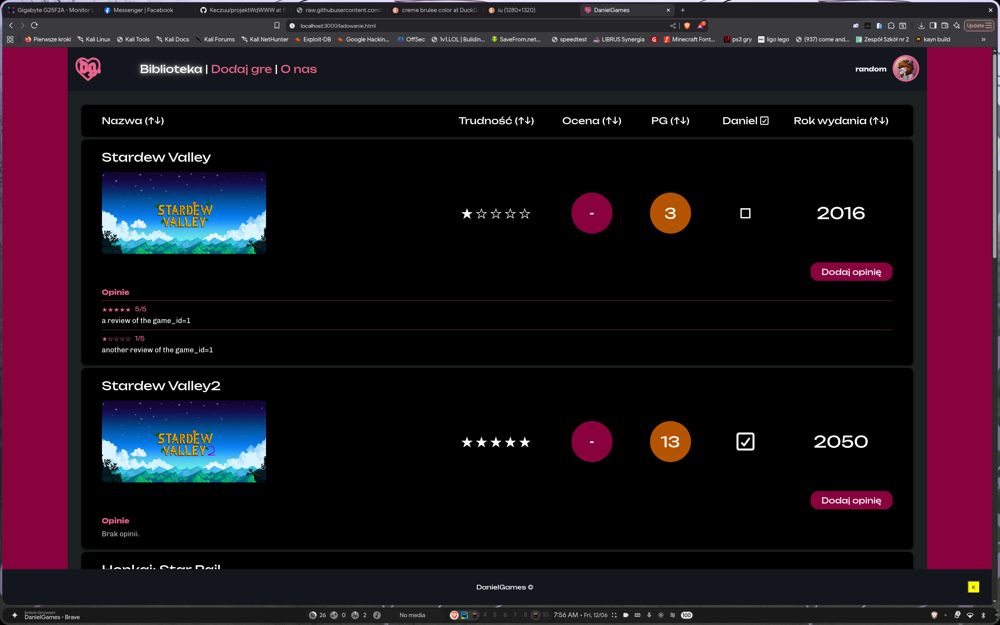
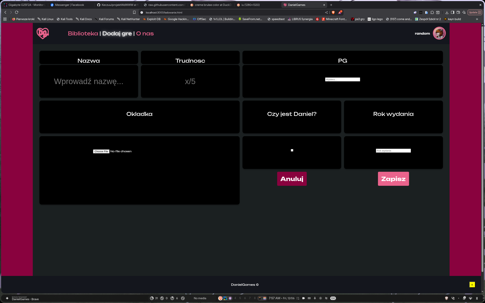
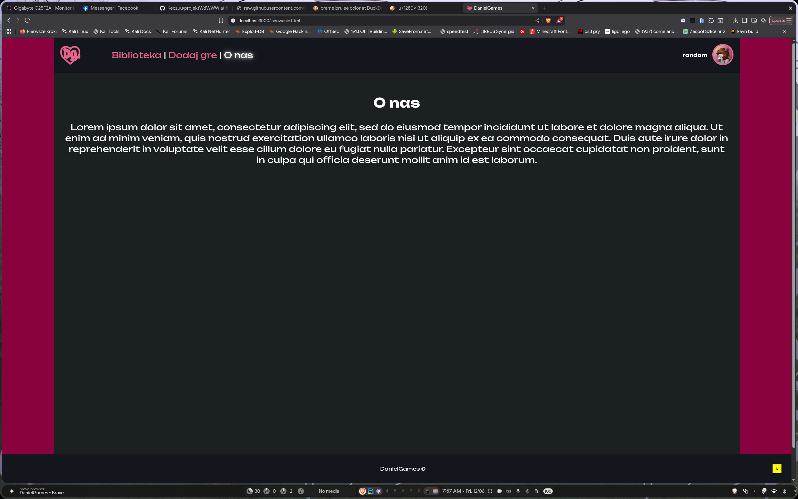
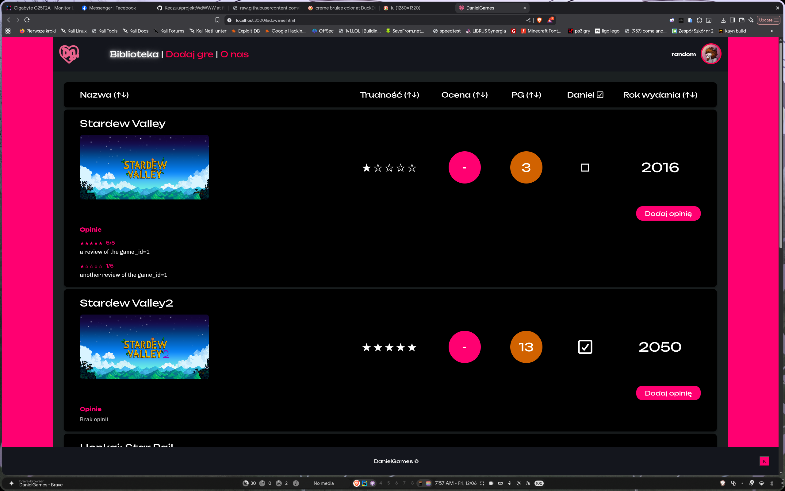

## [Link do projektu w Figmie](https://www.figma.com/design/s25HFnlO3ttlsvkOEacDt7/DanielGames?node-id=0-1&t=higOMiso8P6Gybuj-1)

DanielGames - Twoja biblioteka gier

## Funkcje strony
- Wyswietlanie biblioteki gier
- Mozliwosc dodawania nowych gier
- Mozliwosc sortowania gier wedlug kryteriow

## Uzyte jezyki i budowa strony
Projekt zostal napisany bez uzycia frameworkow.
* **Frontend:** HTML, CSS, JavaScript
* **Backend:** `json-server`

## Uzycie API
* `games`: `GET http://localhost:3000/games` wyswietla pelna liste gier, tagami takimi jak id, title, difficulty, rating, age_rating, year_of_release, daniel i picture.
* `reviews`: `GET http://localhost:3000/reviews` wyswietla recenzje i ocene, wedlug game_id.

## Screeny stronki

* Widok biblioteki gier

* Widok formularza dodawania gry

* Widok o nas

* Widok biblioteki gier z dostepnoscia

## Instrukcja uruchomienia

### Wymagania wstepne
Zainstalowany **Node.js**

### Instalacja i start
1. Sklonowanie badz pobranie pliku zip z plikami repozytorium
2. Utworzenie nowego folderu o nazwie `public` i przeniesienie plikow do niego
3. Wlaczenie cmd w glownym folderze projektu.
4. Zainstalowanie pakietu `json-server`
5. Uruchomienie serwera komenda `npx json-server --watch /public/src/db.json`
6. Wejscie na strone z linku `http://localhost:3000/ladowanie.html`